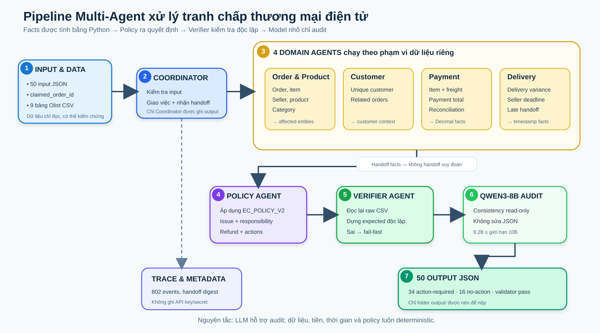

# Kịch bản trình bày pipeline — E-commerce Dispute Resolution



## 1. Phiên bản nói nhanh trong 30 giây

Em xây dựng một pipeline multi-agent để điều tra 50 tranh chấp thương mại điện tử từ dữ liệu Olist. Thay vì cho LLM đọc toàn bộ dữ liệu rồi tự sinh JSON, em chia hệ thống thành các agent theo domain: order/product, customer, payment và delivery. Các agent bàn giao facts cho Policy Agent áp dụng `EC_POLICY_V2`; sau đó một Verifier Agent độc lập đọc lại CSV để kiểm tra toàn bộ kết quả. Qwen3-8B, dưới giới hạn 10B, chỉ audit consistency ở bước cuối và không được sửa output. Nhờ vậy pipeline vừa có handoff multi-agent thật, vừa tránh hallucination ID, timestamp và số tiền.

## 2. Kịch bản trình bày 3–5 phút

### Mở đầu — bài toán và chiến lược

> Bài toán của em là xử lý 50 yêu cầu tranh chấp. Một case không thể kết luận chỉ từ lời khiếu nại mà phải join nhiều nguồn: order, item, seller, payment, customer history và product. Sau đó hệ thống phải xác định lỗi chính, bên chịu trách nhiệm, evidence, refund và action.
>
> Chiến lược của em là dùng multi-agent theo domain, nhưng giữ các phép tính và policy deterministic. Em không để LLM tự tính tiền, tự suy diễn timestamp hoặc tạo evidence, vì đây là các trường có thể kiểm chứng chính xác từ CSV.

### Kiến trúc

Pipeline có bảy agent deterministic và một model auditor cuối:

1. **Coordinator Agent** kiểm tra input, điều phối handoff và là thành phần duy nhất ghi output.
2. **Order & Product Agent** join order, item, seller, product và category.
3. **Customer Agent** tìm `customer_unique_id` và các related order.
4. **Payment Agent** dùng `Decimal` để cộng từng payment row và đối soát với item cộng freight.
5. **Delivery Agent** tính delivery variance và seller handoff variance.
6. **Policy Agent** nhận facts từ bốn domain agent và áp dụng `EC_POLICY_V2` theo priority.
7. **Verifier Agent** đọc lại raw CSV, tự dựng expected output độc lập rồi so sánh với JSON tổng hợp.
8. **Qwen3-8B auditor** chỉ đọc JSON đã pass verifier và ghi nhận consistency vào trace; model không có quyền sửa kết quả.

Điểm quan trọng là đây không phải một prompt lớn được đổi tên thành nhiều agent. Mỗi domain agent có input/output contract riêng, quyền dữ liệu riêng và handoff được ghi thật trong `trace.jsonl`.

### Luồng một case

> Với mỗi input, Coordinator lấy `claimed_order_id`. Order Agent và Customer Agent truy xuất hai nhánh dữ liệu độc lập. Payment Agent nhận item facts để tính expected total; Delivery Agent nhận order và item facts để tính độ trễ. Sau khi bốn nhánh hoàn tất, Coordinator handoff facts sang Policy Agent.
>
> Policy Agent áp dụng sáu rule theo thứ tự ưu tiên: canceled paid, unavailable paid, late do seller, late do logistics, valid split payment và unsupported late claim. Việc dùng priority bảo đảm một case chỉ có một primary issue. Sau đó agent mới thêm secondary issue, responsible party, refund và actions.
>
> Coordinator dựng evidence từ ID tồn tại thật trong CSV. Verifier không tin kết quả vừa nhận; nó đọc lại dữ liệu nguồn và kiểm tra ID, số tiền, timestamp, null handling, enum, giới hạn array và strict JSON. Chỉ case pass mới được ghi ra output và đưa cho model audit.

### Case minh họa EC_002

EC_002 là ví dụ `late_delivery_seller`:

- Giao sau estimated date `87.39` giờ.
- Carrier nhận hàng sau shipping limit của seller `1.04` giờ.
- Vì seller bàn giao muộn nên responsible party là seller, không phải logistics.
- Order có hai payment rows: credit card và voucher.
- Tổng item `194.00` cộng freight `18.27` bằng payment `212.27`, difference bằng `0`.
- Policy đề xuất hoàn freight `18.27 BRL`.
- Evidence gồm order, item, hai payment, seller chịu trách nhiệm và policy code.

Điểm của ví dụ này là kết luận “seller có lỗi” không đến từ lời khách hàng hoặc LLM; nó đến từ hai phép so sánh timestamp có thể audit lại.

### Vai trò của model

> Model em dùng là `qwen/qwen3-8b`, 8.2B parameters qua OpenRouter, đáp ứng giới hạn dưới 10B. Model name được hard-code trong source và metadata; chỉ API key nằm trong `.env` và không commit.
>
> Em cố ý giới hạn model ở vai trò read-only audit. Nếu provider lỗi, deterministic pipeline vẫn có thể chạy và validate; nếu bật `--llm-audit` mà thiếu key thì pipeline fail-fast. Cách này dùng được khả năng kiểm tra ngữ nghĩa của model mà không giao cho model quyền thay đổi dữ liệu tài chính.

### Kết quả

- 50/50 output JSON pass verifier.
- 34 case `action_required`, 16 case `no_action`.
- Đủ sáu loại primary issue.
- Tổng refund đề xuất: `3,437.76 BRL`.
- Trace mới nhất có 802 event, gồm 350 handoff, 250 delegation, 50 verification pass và 50 model audit.
- Điểm chấm ổn định: `95.7718`.

### Kết thúc

> Quyết định kỹ thuật chính của em là tách reasoning thành hai lớp: domain agents thu thập facts, còn policy và verifier đưa ra quyết định có thể tái lập. LLM chỉ hỗ trợ audit. Nhờ đó hệ thống đáp ứng multi-agent, có trace handoff thật, nhưng vẫn giữ độ chính xác và khả năng giải thích cần thiết cho bài toán tranh chấp tài chính.

## 3. Demo 60–90 giây

### Bước 1 — cho xem kết quả tổng quan

```bash
python3 scripts/inspect_cases.py
```

Nói: “Pipeline sinh đủ 50 case, phủ sáu primary issue, 34 action-required, 16 no-action và tổng refund 3,437.76 BRL.”

### Bước 2 — validate toàn bộ output

```bash
python3 -m ecommerce_agents.cli validate
```

Kết quả cần chỉ ra:

```json
{
  "status": "passed",
  "error_count": 0
}
```

### Bước 3 — mở một case minh họa

```bash
jq '{case_assessment, delivery_analysis, payment_reconciliation, root_cause_analysis, financial_resolution}' output/EC_002.json
```

Chỉ giải thích ba con số: `87.39` giờ giao trễ, `1.04` giờ seller bàn giao trễ và refund freight `18.27 BRL`.

### Bước 4 — chứng minh handoff thật

```bash
jq -r '.event' logging/trace.jsonl | sort | uniq -c
```

Chỉ ra các event `agent_delegated`, `a2a_handoff`, `verification_passed` và `llm_read_only_audit`.

Không nên chạy lại `run --llm-audit` khi đang trình bày vì phụ thuộc mạng và mất hơn một phút. Dùng trace của lượt chạy đã kiểm chứng.

## 4. Câu hỏi phản biện thường gặp

### “Tại sao không cho LLM sinh thẳng output?”

Vì output chứa ID, timestamp, phép cộng tiền và policy priority có đáp án xác định. LLM có rủi ro hallucination và sai số. Domain agents deterministic phù hợp hơn; LLM được dùng cho audit consistency cuối.

### “Đây có thực sự là multi-agent không?”

Có. Mỗi agent có contract và quyền dữ liệu riêng. Payment Agent không tự đọc customer; Delivery Agent không đọc payment; Policy Agent không đọc CSV trực tiếp mà nhận facts qua handoff. Trace ghi sender, recipient, case ID, digest và duration cho từng lần giao việc.

### “Verifier khác Policy Agent ở đâu?”

Policy Agent đưa ra quyết định từ facts đã handoff. Verifier là tuyến phòng thủ độc lập: nó đọc lại raw CSV và dựng expected JSON riêng, không tái sử dụng output của Policy Agent làm ground truth.

### “Nếu LLM trả lời sai thì sao?”

LLM không có quyền mutate output. Phản hồi chỉ được ghi vào trace. Các JSON đã pass deterministic verifier trước khi model được gọi.

### “Tại sao dùng Qwen3-8B?”

Model có 8.2B parameters, dưới giới hạn 10B, đủ cho audit JSON ngắn và có thể gọi qua OpenRouter. Model name nằm trong source/metadata để chấm; secret chỉ nằm trong `.env`.

### “Làm sao tránh hard-code 50 case?”

Source không chứa danh sách case ID hoặc order ID để quyết định kết quả. Tất cả output được sinh từ join CSV và các rule tổng quát của `EC_POLICY_V2`. Tests có thể kiểm tra case đại diện, nhưng production logic không rẽ nhánh theo case ID.

### “Evidence được bảo đảm thế nào?”

Evidence chỉ được dựng theo năm namespace hợp lệ: order, item, payment, seller chịu trách nhiệm và policy. Verifier kiểm tra lại ID với CSV và không cho evidence không tồn tại đi vào output.

### “Xử lý tiền và thời gian ra sao?”

Tiền dùng `Decimal` và `ROUND_HALF_UP`, không dùng float để tính. Timestamp giữ nguyên dữ liệu nguồn; variance được tính và làm tròn hai chữ số.

### “Edge case quan trọng nhất là gì?”

Hai nhóm chính là order không có item và order không có đủ timestamp giao hàng. Với item rỗng, tổng item/freight là 0 nhưng expected total, difference và reconciled là unknown (`null`). Khi không có carrier timestamp, pipeline không suy diễn `late_handoff: false`; handoff analysis phải rỗng.

### “Nếu provider hoặc network lỗi?”

Deterministic run và validator không phụ thuộc provider. Chế độ audit fail-fast nếu thiếu key hoặc network lỗi, đồng thời ghi event lỗi; output tài chính không bị model sửa.

### “Vì sao điểm không phải 100?”

Điểm 95.7718 cho thấy pipeline đã qua toàn bộ hard gate và bám sát rubric. Khi tối ưu, em ưu tiên tính đúng nghiệp vụ, khả năng giải thích và không hard-code thay vì chỉnh output thủ công theo leaderboard.

## 5. File nên mở sẵn trước khi trình bày

1. `architecture.md` — sơ đồ và contracts.
2. `ecommerce_agents/coordinator.py` — orchestration và handoff.
3. `ecommerce_agents/agents/policy.py` — sáu policy rule.
4. `ecommerce_agents/agents/verifier.py` — verification độc lập.
5. `output/EC_002.json` — case minh họa.
6. `logging/trace.jsonl` và `logging/metadata.json` — bằng chứng runtime/model.

## 6. Ba câu cần nhớ nếu bị gọi bất ngờ

1. “Em chia agent theo domain dữ liệu, không chia giả bằng cách đặt nhiều tên quanh một prompt.”
2. “Facts và phép tính là deterministic; Qwen3-8B chỉ audit read-only nên không thể làm sai số tiền hoặc evidence.”
3. “Verifier đọc lại raw CSV độc lập trước khi Coordinator ghi output, nên mọi kết luận đều có thể truy vết.”
