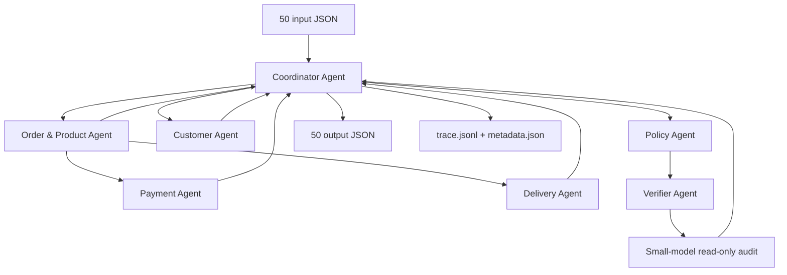

# Kiến trúc Multi-Agent — Olist E-commerce Dispute Resolution

## 1. Mục tiêu thiết kế

Hệ thống xử lý đúng 50 case theo `EC_POLICY_V2`, ưu tiên dữ liệu CSV có thể kiểm chứng. LLM không được phép tự tạo sự kiện, ID, số tiền hoặc thay đổi kết quả của rule engine. Mỗi agent có input/output contract riêng và mọi handoff đều được ghi vào `logging/trace.jsonl`.

Model được khai báo cố định trong source:

- Provider: OpenRouter
- Model: `qwen/qwen3-8b`
- Parameter count: 8,2B
- Giới hạn đề bài: ≤10B
- Vai trò: audit consistency chỉ đọc sau deterministic verifier

## 2. Sơ đồ agent và handoff

Pipeline không gọi Review hoặc Geolocation Agent vì review/geolocation không xuất hiện trong output contract và không tham gia bất kỳ điều kiện nào của `EC_POLICY_V2`.

## 3. Vai trò, quyền truy cập và contract

| Agent | Input | Quyền dữ liệu | Output/handoff |
| --- | --- | --- | --- |
| Coordinator | Input case | Đọc input, điều phối; ghi output/log | JSON cuối và trace |
| Order & Product | `claimed_order_id`, product-scope | Đọc orders, items, products, sellers | Order facts, affected entities, product context |
| Customer | Order ID, history-scope | Đọc orders, customers | `customer_unique_id`, related orders |
| Payment | Order ID, item rows | Đọc payments; nhận items qua handoff | Tổng item/freight/payment, difference, reconciled |
| Delivery | Order row, item rows | Không đọc payment/customer | Delivery variance và handoff theo seller |
| Policy | Facts của bốn domain agent | Không đọc CSV trực tiếp | Issue taxonomy, responsibility, refund, actions |
| Verifier | Input case, JSON tổng hợp | Read-only repository | Danh sách lỗi hoặc xác nhận pass |
| LLM audit | JSON đã pass deterministic verifier | Chỉ đọc JSON; không có tool ghi file | Nhận xét consistency ngắn |

Các agent domain trả về hai lớp dữ liệu:

1. `output`: phần public được dùng trong JSON cuối.
2. `facts`: dữ liệu nội bộ có kiểu chính xác như `Decimal`, raw rows và counters cho Policy Agent.

Nhờ tách hai lớp, tiền không bị tính lại từ float của JSON.

## 4. Data flow

1. Coordinator kiểm tra đủ `EC_001.json`–`EC_050.json`, `case_id`, policy version và sự tồn tại của order.
2. Order & Product Agent truy xuất order, item, seller, product và category theo thứ tự nguồn.
3. Customer Agent dùng `customer_unique_id`, loại order hiện tại và giới hạn tối đa 5 related orders.
4. Payment Agent dùng `Decimal`, cộng từng payment row và không nhân với installments.
5. Delivery Agent tính số giờ từ timestamp gốc; deadline của mỗi seller là `shipping_limit_date` sớm nhất trong các item của seller đó.
6. Policy Agent áp dụng primary issue đúng thứ tự ưu tiên, sau đó mới thêm secondary issues và actions.
7. Coordinator dựng evidence chỉ từ order/item/payment/seller/policy ID hợp lệ.
8. Verifier đối chiếu lại source ID, timestamp, payment total, null handling, enum, array limits và strict JSON.
9. Khi bật `--llm-audit`, Qwen3-8B chỉ nhận JSON đã pass và ghi nhận audit vào trace. Phản hồi LLM không được sửa output.
10. Mỗi output được ghi vào `output/<case_id>.json`; metadata và trace chỉ đại diện lượt chạy mới nhất.

## 5. Deterministic policy boundary

Các phép tính sau luôn do Python thực hiện:

- `delivery_variance_hours`
- `handoff_variance_hours`
- `item_total_brl`, `freight_total_brl`, `expected_total_brl`
- `payment_total_brl`, `difference_brl`, `reconciled`
- primary/secondary issue priority
- responsible parties, refund và action ordering
- evidence construction và array truncation

Mọi giá trị tiền và số giờ được làm tròn hai chữ số bằng `Decimal` với `ROUND_HALF_UP`. Timestamp được giữ nguyên chuỗi nguồn trong JSON.

## 6. Trace và khả năng audit

`logging/trace.jsonl` được truncate ở đầu mỗi run. Mỗi dòng có:

- UTC timestamp, run ID, sequence và case ID;
- event type, agent gửi và agent nhận;
- digest SHA-256 của payload/output thay vì sao chép dữ liệu lớn;
- thời gian thực thi;
- model name, parameter count và cờ `model_used`;
- request ID/token usage cho audit model, không có API key.

Event chính gồm `agent_delegated`, `a2a_handoff`, `verification_passed`, `llm_read_only_audit`, `case_completed` và trạng thái toàn run.

## 7. Bảo mật và quyền ghi

- Secret chỉ được đọc từ `.env:OPENROUTER_API_KEY`.
- `.env`, ZIP, `.DS_Store`, virtualenv và cache bị chặn bởi `.gitignore`.
- Model name không nằm trong `.env`; nó được khai báo tại `ecommerce_agents/config.py` và metadata.
- Agent domain và LLM không có quyền ghi output trực tiếp; chỉ Coordinator ghi artifact.
- Trace và metadata không ghi prompt chứa key, HTTP authorization header hoặc secret.

## 8. Failure handling

Pipeline fail-fast khi thiếu input, order không tồn tại, policy không match, verifier phát hiện lỗi hoặc `--llm-audit` được yêu cầu nhưng thiếu key. Event `case_failed` được ghi trước khi dừng. Output ZIP chỉ được tạo khi có đúng 50 JSON và source/input không còn thay đổi chưa commit.
